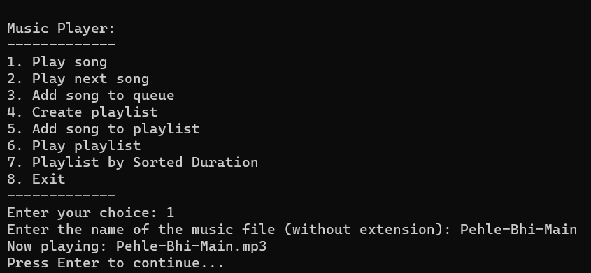
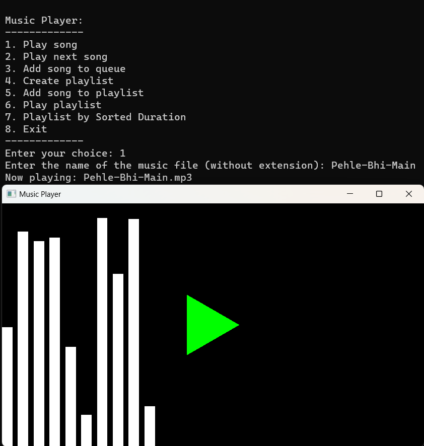

# Music Player

## Introduction
Welcome to the Music Player project – a simple yet powerful application developed for a programming assignment or personal project. Immerse yourself in an enhanced music experience, managing playlists and enjoying a visualizer for each track.

## Features
- **Play and Pause:** Easily control music playback with a user-friendly play/pause button.
- **Stop:** Halt the current song whenever you desire.
- **Volume Control:** Adjust the volume seamlessly using convenient keyboard shortcuts.
- **Skip Songs:** Effortlessly navigate through your playlist to find the perfect track.
- **Playlist Management:** Create, load, and save your favorite playlists effortlessly.
- **Visualizer:** Enhance your music experience with a dynamic visual representation.

## Usage
- Use the play/pause button or hit the Space key to control playback.
- Adjust volume with the Up and Down arrow keys.
- Skip songs with the 'N' key.
- Create and manage playlists following on-screen instructions.

## Contributors
Made with ❤️ by:
- Deepak Kumar
- Gautam Sodhi
- Gaurang Garg

## Images

<!-- Add more screenshots as needed with appropriate captions -->
